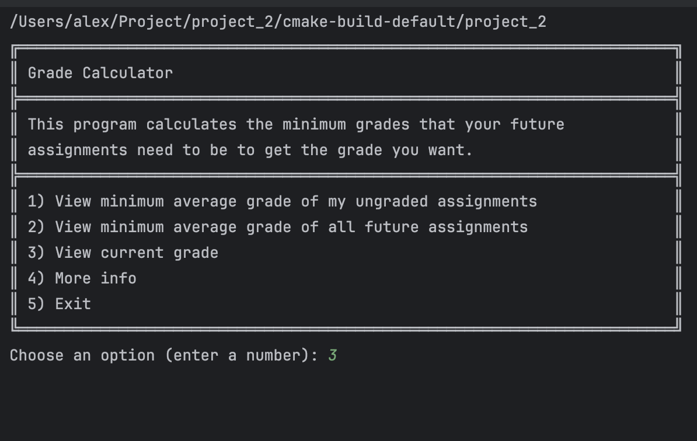
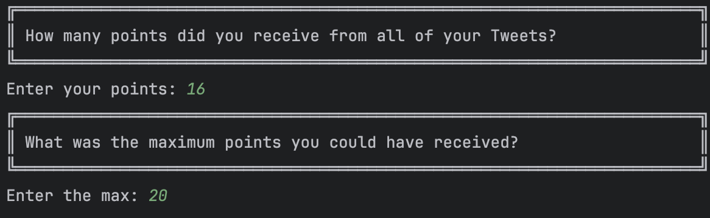
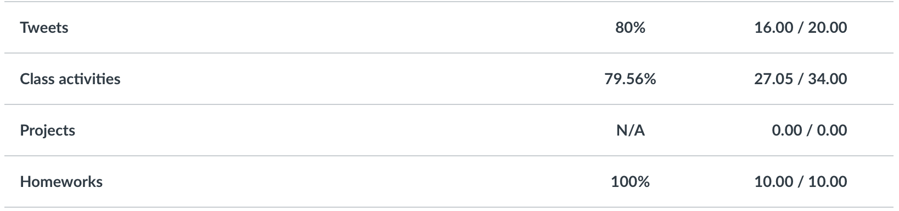
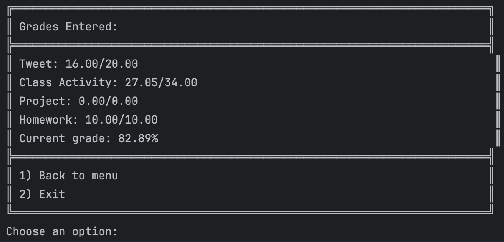
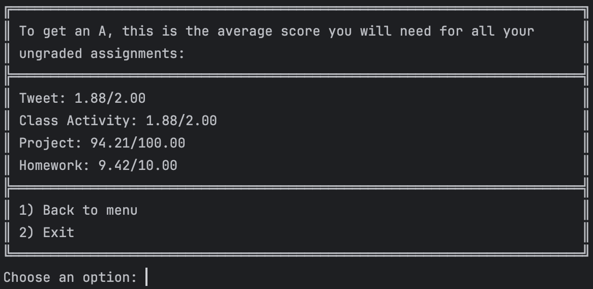
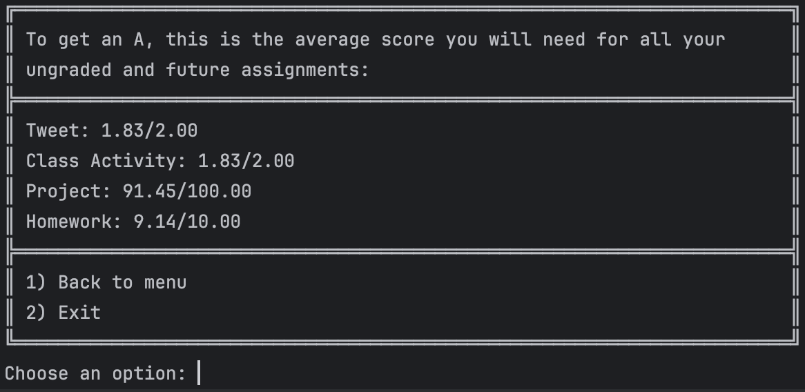

### Grade Calculator by Alexander Li

---
#### Video link:
https://drive.google.com/file/d/1bvUmRtAR05Iv2j-i65tP8AOoiC4yfSfA/view?usp=share_link

---

#### Summary:
Have you ever wondered what you must do to get the 
desired grade in a class? With this program, students can 
get a clear answer.  This program calculates the minimum 
average score of all future and ungraded assignments to Ace CS25.

---

#### Thoughts

The underlying reason for creating this project is based on
my past observations. I noticed that my classmates and I
were creating projects that nobody wanted to use. It's
so wasteful to put all that effort into something just to
forget about it later.

I asked myself if there was something that could
benefit my classmates and me, and noticed that we were
all panicking about our grades. However, most of our 
assignments weren't graded yet. All that uncertainty was 
frightening and was the root cause of our concerns.

The reason I made this program was to relieve that feeling
and create a clear pathway to achieve for my classmates
and I to reach our desired grade.

---

#### Tutorial:

A main menu allows the user to interface with the
different options.

Selection any option will prompt the user to
enter their grades according to the instruction.

The proper inputs can be found on the Canvas CS25
grades page. The table from the image is all
the way at the bottom.

With the proper inputs, the user can double
check them by choosing "View current grade."

Furthermore, the program can calculate
the minimum average grade you will need
to get ace the class. One option determines 
what submitted but ungraded assignments need
to score.

Another option calculates what ungraded and
future assignments need to score. Future
assignments are just estimates. For instance, 
Tweets are assigned every week. So there are 
potentially fourteen of them.

